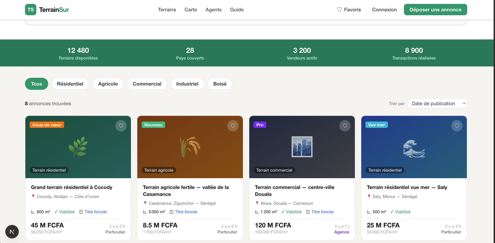

# 🌍 TerrainSur

> La plateforme de référence pour l'achat et la vente de terrains en Afrique.



---

## 📌 À propos

**TerrainSur** est une marketplace immobilière spécialisée dans les **terrains à vendre en Afrique** — résidentiels, agricoles, commerciaux, industriels ou boisés. Inspirée du modèle leboncoin, elle connecte vendeurs particuliers et agences avec des acheteurs.

Le projet est construit avec **Next.js 16**, **React 19** et **Tailwind CSS 4**, avec une interface pensée pour être rapide, claire et mobile-friendly.

---

## ✨ Fonctionnalités

- 🔍 **Recherche en temps réel** par ville, quartier ou pays
- 🎛️ **Filtres avancés** : type de terrain, superficie minimale, prix maximum, viabilisation, titre foncier
- 🗂️ **Tri** des annonces par date, prix ou superficie
- 🃏 **Grille d'annonces** responsive (1 → 4 colonnes selon l'écran)
- ❤️ **Favoris** interactifs par annonce
- 🌍 **Navigation par pays** (28 pays africains)
- 📱 **Menu mobile** responsive
- 🏷️ **Badges** : Coup de cœur, Nouveau, Urgent, Vue mer, Pro
- 📊 **Statistiques** plateforme en temps réel
- 🔒 **Indicateurs de confiance** : vendeur vérifié, titre foncier, viabilisation

---

## 🛠️ Stack technique

| Technologie | Version | Rôle |
|---|---|---|
| [Next.js](https://nextjs.org/) | 16.2.1 | Framework React (App Router) |
| [React](https://react.dev/) | 19.2.4 | UI |
| [Tailwind CSS](https://tailwindcss.com/) | 4 | Styling |
| TypeScript | 5 | Typage statique |
| ESLint | 9 | Linting |

---

## 🚀 Démarrage rapide

### Prérequis

- Node.js ≥ 20.9.0
- npm / yarn / pnpm / bun

### Installation

```bash
git clone https://github.com/your-username/terrains-sur.git
cd terrains-sur
npm install
```

### Lancer en développement

```bash
npm run dev
```

Ouvrez [http://localhost:3000](http://localhost:3000) dans votre navigateur.

### Build de production

```bash
npm run build
npm run start
```

---

## 📁 Structure du projet

```
terrains-sur/
├── public/
│   └── screenshot.png        # Capture d'écran de l'interface
├── src/
│   └── app/
│       ├── globals.css       # Styles globaux + Tailwind
│       ├── layout.tsx        # Layout racine (metadata, fonts)
│       └── page.tsx          # Page d'accueil (composant principal)
├── next.config.ts
├── tailwind.config.*
├── tsconfig.json
└── package.json
```

---

## 🗺️ Feuille de route

- [ ] Page détail d'une annonce
- [ ] Système d'authentification (vendeurs / acheteurs)
- [ ] Dépôt d'annonce avec upload de photos
- [ ] Vue carte interactive (Leaflet / Mapbox)
- [ ] Messagerie intégrée vendeur ↔ acheteur
- [ ] Espace agent / agence avec tableau de bord
- [ ] Notifications et alertes de nouvelles annonces
- [ ] Support multi-devises (FCFA, GHS, NGN, MAD…)
- [ ] Version mobile native (React Native / Expo)

---

## 🤝 Contribuer

Les contributions sont les bienvenues ! Pour proposer une amélioration :

1. Forkez le dépôt
2. Créez une branche (`git checkout -b feature/ma-feature`)
3. Commitez vos changements (`git commit -m 'feat: ajouter ma feature'`)
4. Pushez la branche (`git push origin feature/ma-feature`)
5. Ouvrez une Pull Request

---

## 📄 Licence

Ce projet est sous licence **MIT**. Voir le fichier [LICENSE](LICENSE) pour plus de détails.

---

<p align="center">Fait avec ❤️ pour l'Afrique</p>